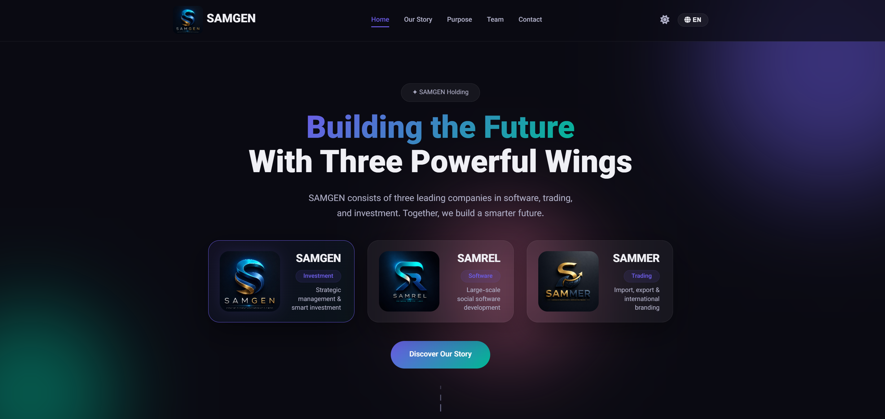

# 🌐 SAMGEN | هلدینگ سام‌جن

**SAMGEN** صفحه فرود رسمی هلدینگ سام‌جن است. این سایت با طراحی مدرن، کاملاً ریسپانسیو و دوزبانه (فارسی/انگلیسی) ساخته شده است تا هویت برند، تیم، خدمات و فلسفه‌ی شرکت را به‌صورتی حرفه‌ای و جذاب به مخاطبان معرفی کند.

---

## ✨ ویژگی‌های برجسته

- 🌗 **تم روز/شب** با قابلیت ذخیره‌سازی خودکار در مرورگر کاربر
- 🌍 **دو زبان کامل** (فارسی و انگلیسی) با تغییر جهت خودکار صفحه (RTL/LTR)
- 📱 **طراحی کاملاً ریسپانسیو** سازگار با موبایل، تبلت، لپ‌تاپ و دسکتاپ
- 🎞️ **اسلایدر اتوماتیک اعضای هیئت مدیره** با حرکت بی‌نهایت و دکمه‌های کنترل
- 🔢 **شمارنده‌های پویا** هنگام اسکرول (سال‌های تجربه، تعداد شرکت‌ها، پروژه‌های موفق)
- 🧭 **منوی فعال** که هنگام اسکرول یا کلیک، بخش جاری را مشخص می‌کند
- 🖼️ **جلوه‌ی پارالاکس** در بخش هیرو با اُرب‌های گرادینت شناور
- 🎨 **طراحی شیشه‌ای (Glassmorphism)** در کارت‌ها و بخش‌های مختلف
- ✨ **انیمیشن‌های ورود المان‌ها** هنگام اسکرول (Fade-in)
- 📖 **معرفی فلسفه‌ی برند** با توضیح کامل مفهوم `GEN = Genesis + Generate + Generation`

---

## 🏛️ درباره‌ی هلدینگ SAMGEN

**SAMGEN** هلدینگ سام‌جن از سه شرکت پیشرو تشکیل شده است:

| شرکت | حوزه | فعالیت |
| :--- | :--- | :--- |
| **SAMREL** | نرم‌افزار | توسعه‌ی سیستم‌های بزرگ‌مقیاس اجتماعی |
| **SAMMER** | بازرگانی | واردات، صادرات و برندینگ بین‌المللی |
| **SAMGEN** | سرمایه‌گذاری | مدیریت استراتژیک و سرمایه‌گذاری هوشمند |

**معنای نام:**  
`SAM` نام ثابت هلدینگ و `GEN` مخفف سه مفهوم قدرتمند است:  
**Genesis** (آغاز) • **Generate** (تولید) • **Generation** (نسل)

---

## 🛠️ تکنولوژی‌های استفاده‌شده

| تکنولوژی | کاربرد |
| :--- | :--- |
| **HTML5** | ساختار اصلی صفحات |
| **CSS3 (Custom Properties)** | طراحی زیبا، انیمیشن‌ها و مدیریت تم‌های روز/شب |
| **JavaScript (Vanilla)** | تمام منطق تعاملی (اسلایدرها، شمارنده‌ها، تغییر زبان و تم، منوی فعال) |
| **Font Awesome** | کتابخانه‌ی آیکون‌های گرافیکی |
| **Vazirmatn Font** | فونت فارسی زیبا و خوانا |

---
📜 مجوز
این پروژه تحت مجوز MIT منتشر شده است. برای اطلاعات بیشتر، فایل LICENSE را مشاهده کنید.
---
📞 ارتباط با ما
وب‌سایت رسمی: https://samgen.ir

ایمیل: info@samgen.ir

تلفن: +989336002873
---
## 👨‍💻 توسعه‌دهنده

این پروژه توسط **[SAMREL](https://samrel.com)** طراحی و پیاده‌سازی شده است.

---

**ساخته شده با ❤️ برای [SAMGEN](https://samgen.ir)**
